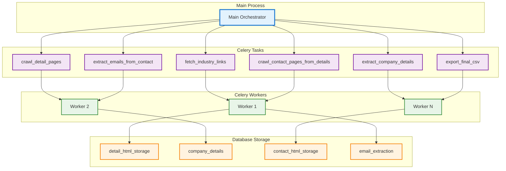

# PCrawler - Modular Web Crawler System

> Hệ thống crawl dữ liệu công ty và email với kiến trúc modular, hỗ trợ nhiều website

**🚀 Khuyến nghị: Sử dụng Makefile để dễ dàng quản lý và chạy ứng dụng**

## Quick Start

### Sử dụng Makefile (Khuyến nghị)

```bash
# Xem tất cả commands có sẵn
make help

# Setup và chạy nhanh nhất
make docker-build
make docker-scale-2
# Hoặc
make docker-crawl
```

### Commands chính

```bash
# Docker Setup
make docker-build    # Build Docker images
make docker-up       # Start services (Redis + Worker)
make docker-down     # Stop all services
make docker-logs     # Show logs

# Crawling
make crawl           # Start crawling (local)
make docker-crawl    # Start crawling (Docker)

# Scaling (tối ưu performance)
make docker-scale-1  # Safe mode (1 worker) - Low risk, slower
make docker-scale-2  # Fast mode (2 workers) - Balanced speed/risk

# Manual
make docker-merge    # Merge CSV files
```

## Architecture Flow

### Crawling Process Flow

```mermaid
%%{init: {'theme':'base', 'themeVariables': { 'primaryColor': '#ff0000', 'primaryTextColor': '#000000', 'primaryBorderColor': '#000000', 'lineColor': '#000000', 'secondaryColor': '#ffffff', 'tertiaryColor': '#ffffff', 'background': '#ffffff', 'mainBkg': '#ffffff', 'secondBkg': '#ffffff', 'tertiaryBkg': '#ffffff'}}}%%
graph TB
    subgraph "Row 1: Data Collection"
        A["🔗 Phase 0<br/>Link Fetching"] --> B["📄 Phase 1<br/>Detail Crawling"]
        B --> C["🔍 Phase 2<br/>Extract Details"]
    end

    subgraph "Row 2: Contact & Email"
        D["🌐 Phase 3<br/>Contact Crawling"] --> E["📧 Phase 4<br/>Email Extraction"]
        E --> F["📊 Phase 5<br/>Final Export"]
    end

    C --> D

    %% Styling
    classDef phase0 fill:#e1f5fe,stroke:#01579b,stroke-width:4px,font-size:18px,font-weight:bold
    classDef phase1 fill:#f3e5f5,stroke:#4a148c,stroke-width:4px,font-size:18px,font-weight:bold
    classDef phase2 fill:#e8f5e8,stroke:#1b5e20,stroke-width:4px,font-size:18px,font-weight:bold
    classDef phase3 fill:#fff3e0,stroke:#e65100,stroke-width:4px,font-size:18px,font-weight:bold
    classDef phase4 fill:#fce4ec,stroke:#880e4f,stroke-width:4px,font-size:18px,font-weight:bold
    classDef phase5 fill:#f1f8e9,stroke:#33691e,stroke-width:4px,font-size:18px,font-weight:bold

    class A phase0
    class B phase1
    class C phase2
    class D phase3
    class E phase4
    class F phase5
```



### Database Tables


### Phase Details

#### **Phase 0: Link Fetching (PARALLEL)**

- **Input**: Base URL, Industries list
- **Process**: Submit industry link fetching tasks to Celery workers
- **Output**: All company links collected
- **Time**: ~20-30 minutes (vs 3+ hours sequential)

#### **Phase 1: Detail HTML Crawling (PARALLEL)**

- **Input**: Company links from Phase 0
- **Process**: Crawl detail pages, store HTML content
- **Output**: HTML stored in `detail_html_storage` table
- **Time**: ~3 hours for 22k companies

#### **Phase 2: Company Details Extraction (PARALLEL)**

- **Input**: HTML from `detail_html_storage`
- **Process**: Extract company info (name, address, phone, website, social media)
- **Output**: Structured data in `company_details` table
- **Time**: ~1.2 hours for 22k companies

#### **Phase 3: Contact HTML Crawling (PARALLEL)**

- **Input**: Website/Facebook URLs from `company_details`
- **Process**: Crawl contact pages, store HTML content
- **Output**: HTML stored in `contact_html_storage` table
- **Time**: ~4.9 hours for 22k companies

#### **Phase 4: Email Extraction (PARALLEL)**

- **Input**: HTML from `contact_html_storage`
- **Process**: Extract emails using Crawl4AI queries
- **Output**: Emails in `email_extraction` table
- **Time**: ~1.8 hours for 22k companies

#### **Phase 5: Final CSV Export**

- **Input**: All tables (detail_html_storage, company_details, email_extraction)
- **Process**: Join tables, create final CSV
- **Output**: `company_contacts.csv` with all data
- **Time**: ~1 minute

### Performance Comparison

| Phase              | Sequential    | Parallel      | Improvement       |
| ------------------ | ------------- | ------------- | ----------------- |
| Link Fetching      | 3.3 hours     | 20 minutes    | **10x faster**    |
| Detail Crawling    | 3 hours       | 3 hours       | Same              |
| Details Extraction | 1.2 hours     | 1.2 hours     | Same              |
| Contact Crawling   | 4.9 hours     | 4.9 hours     | Same              |
| Email Extraction   | 1.8 hours     | 1.8 hours     | Same              |
| CSV Export         | 1 minute      | 1 minute      | Same              |
| **TOTAL**          | **~14 hours** | **~11 hours** | **3 hours saved** |

### Celery Tasks



#### Task Descriptions

| Task                               | Purpose                             | Input                 | Output                    |
| ---------------------------------- | ----------------------------------- | --------------------- | ------------------------- |
| `fetch_industry_links`             | Get company links for each industry | Industry ID, Name     | List of company URLs      |
| `crawl_detail_pages`               | Crawl company detail pages          | Company URLs          | HTML stored in DB         |
| `extract_company_details`          | Extract company info from HTML      | HTML content          | Structured company data   |
| `crawl_contact_pages_from_details` | Crawl contact pages                 | Website/Facebook URLs | Contact HTML stored in DB |
| `extract_emails_from_contact`      | Extract emails from contact HTML    | Contact HTML          | Email addresses           |
| `export_final_csv`                 | Create final CSV file               | All database tables   | Final CSV output          |

## Workflow

### 1. Setup Docker

```bash
make docker-build    # Build images
make docker-scale-2  # Start với 2 workers (tối ưu)
```

### 2. Start Crawling

```bash
make docker-crawl    # Bắt đầu crawl
make docker-logs     # Xem logs real-time
```

### 3. Monitor Progress

```bash
make docker-logs     # Xem logs
# Hoặc
docker-compose logs -f worker
```

### 4. Merge Results (nếu cần)

```bash
make docker-merge    # Gộp tất cả CSV files
```

## Performance Tips

### Scaling Options:

- **Safe mode (1 worker)**: Ít rủi ro, chậm hơn
- **Fast mode (2 workers)**: Cân bằng tốc độ/rủi ro (khuyến nghị)

### Memory Management:

- Tự động giới hạn RAM 3GB/worker
- Garbage collection sau mỗi task
- Worker restart định kỳ để tránh memory leak

## Kiến trúc

### Modules chính:

- `app/crawler/list_crawler.py`: Crawl danh sách ngành và link công ty
- `app/crawler/detail_crawler.py`: Crawl chi tiết công ty (song song)
- `app/extractor/email_extractor.py`: Extract email bằng crawl4ai
- `app/tasks/`: Celery tasks cho xử lý bất đồng bộ
- `app/utils/batching_writer.py`: Ghi CSV an toàn theo batch
- `config/`: Hệ thống config YAML linh hoạt

### Workflow:

1. **Crawl Industries** → Lấy danh sách ngành
2. **Crawl Company Links** → Lấy link công ty theo ngành
3. **Create Tasks** → Chia thành batch và gửi vào Celery queue
4. **Process Tasks** → Mỗi task crawl chi tiết + extract email
5. **Merge Results** → Gộp tất cả file CSV cuối cùng

## Configuration

### Config có sẵn:

- `default`: Cấu hình mặc định
- `1900comvn`: Cấu hình cho 1900.com.vn
- `example`: Cấu hình ví dụ cho website khác

### Tạo config mới:

```bash
# Copy config có sẵn
cp config/configs/default.yml config/configs/mywebsite.yml

# Chỉnh sửa file config
vim config/configs/mywebsite.yml

# Validate config
uv run python -m app.main validate --config mywebsite

# Chạy với config mới
uv run python -m app.main crawl --config mywebsite
```

### Cấu trúc YAML:

```yaml
website:
  name: "Website Name"
  base_url: "https://example.com"

xpath:
  company_name: "//h1[@class='company-title']"
  company_address: "//div[@class='address']"
  # ... các xpath khác

crawl4ai:
  website_query: "Extract business emails from website"
  facebook_query: "Extract business emails from Facebook"

processing:
  batch_size: 30
  write_batch_size: 150
  max_concurrent_pages: 6
  max_retries: 2
  delay_range: [1.5, 3.0]
  timeout: 60000
  network_timeout: 20000
  stealth_mode: true

output:
  output_dir: "data/tasks"
  final_output: "data/companies.csv"

fieldnames:
  - industry_name
  # ... các field khác
```

## Dữ liệu Output

### Fields trong CSV:

- `industry_name`: Thông tin ngành
- `name`, `address`, `website`, `phone`: Thông tin cơ bản công ty
- `created_year`, `revenue`, `scale`: Thông tin kinh doanh
- `link`, `facebook`, `linkedin`, `tiktok`, `youtube`, `instagram`: Social media
- `extracted_emails`: Email được extract (phân cách bằng "; ")
- `email_source`: Nguồn email (Facebook/Website/N/A)

### Phone number format:

- Tự động clean và format thành dạng: `+84933802408`
- Loại bỏ ký tự đặc biệt, dấu cách
- Chuyển đổi từ 0 thành +84 (VD: 0933802408 → +84933802408)
- Giữ nguyên nếu đã có +84
- Đảm bảo độ dài 11-12 số (bao gồm 84)

## Development

### Setup Development Environment:

```bash
# Cài đặt dependencies
source ./.venv/bin/activate.sh
pip install -r requirements.txt

# Hoặc với uv
uv pip install -r requirements.txt
```

### Project Structure:

```
pcrawler/
├── app/
│   ├── crawler/          # Crawling modules
│   ├── extractor/        # Email extraction
│   ├── tasks/           # Celery tasks
│   ├── utils/           # Utilities
│   └── main.py          # Main orchestrator
├── config/
│   ├── configs/         # YAML configurations
│   └── crawler_config.py # Config loader
├── tests/               # Test files
├── data/               # Output data
├── docker-compose.yml  # Docker setup
├── Makefile           # Development commands
└── pyproject.toml     # Project metadata
```

## Docker

### Services:

- `redis`: Message broker cho Celery
- `worker`: Celery worker xử lý tasks (có thể scale)
- `app`: Main application

### Memory Limits:

- **Worker**: 3GB RAM limit, 2GB reservation
- **Max tasks per child**: 20 tasks (tự động restart)
- **Max memory per child**: 2GB (tự động restart nếu vượt)

### Environment Variables:

```bash
CELERY_BROKER_URL=redis://redis:6379/0
CELERY_RESULT_BACKEND=redis://redis:6379/0
CELERY_WORKER_MAX_TASKS_PER_CHILD=20
CELERY_WORKER_MAX_MEMORY_PER_CHILD=2000000
```

## Monitoring & Logging

### Memory Monitoring:

```bash
# Xem logs với memory info
make docker-logs

# Memory logs sẽ hiển thị:
# [MEMORY][Task xxx] start: 150 MB
# [MEMORY][Task xxx] after GC: 120 MB (freed ~30 MB)
# [MEMORY][Batch] before: 200 MB
# [MEMORY][Batch] after GC: 180 MB (freed ~20 MB)
```

### Log Levels:

- `DEBUG`: Chi tiết nhất, dành cho development
- `INFO`: Thông tin chung (mặc định)
- `WARNING`: Cảnh báo
- `ERROR`: Lỗi

### Docker Logs:

```bash
# Xem tất cả logs
make docker-logs

# Xem logs worker
docker-compose logs -f worker

# Xem logs app
docker-compose logs -f app
```

## Error Handling

### Retry Logic:

- Tự động retry khi crawl thất bại
- Configurable retry count và delay
- Graceful handling của network errors

### Task Recovery:

- Mỗi task tạo file riêng
- Có thể gộp lại file nếu quá trình bị gián đoạn
- Không mất dữ liệu khi task fail

## Security & Best Practices

### Rate Limiting:

- Configurable delay giữa các request
- Respect robots.txt
- User-Agent rotation

### Data Validation:

- Validate config trước khi chạy
- Clean và format dữ liệu
- Validate email format

## Contributing

1. Fork project
2. Tạo feature branch: `git checkout -b feature/amazing-feature`
3. Commit changes: `git commit -m 'Add amazing feature'`
4. Push to branch: `git push origin feature/amazing-feature`
5. Tạo Pull Request

### Code Style:

```bash
# Format code (nếu có black)
uv run black .

# Check linting (nếu có flake8)
uv run flake8 .

# Run tests (nếu có pytest)
uv run pytest
```

## License

MIT License - xem file [LICENSE](LICENSE) để biết thêm chi tiết.

## Troubleshooting

### Common Issues:

1. **Docker không start:**

   ```bash
   make docker-down
   make docker-build
   make docker-scale-2
   ```

2. **Celery worker không nhận tasks:**

   ```bash
   # Check Redis connection
   docker-compose exec redis redis-cli ping

   # Restart worker
   docker-compose restart worker
   ```

3. **Memory usage cao:**

   ```bash
   # Xem memory logs
   make docker-logs | grep MEMORY

   # Worker sẽ tự restart sau 20 tasks hoặc 2GB RAM
   # Không cần can thiệp thủ công
   ```

4. **Crawl chậm:**

   ```bash
   # Tăng số workers
   make docker-scale-2  # Thay vì docker-scale-1

   # Hoặc scale cao hơn (cẩn thận)
   docker-compose up --scale worker=4 -d
   ```

### Debug Mode:

```bash
# Xem logs chi tiết
make docker-logs

# Xem logs worker
docker-compose logs -f worker --tail=100

# Xem logs app
docker-compose logs -f app --tail=100
```

## Support

- Email: phuoctv.ut@gmail.com
- Issues: [GitHub Issues](https://github.com/tranvietphuoc/pcrawler/issues)
- Documentation: [Wiki](https://github.com/tranvietphuoc/pcrawler/wiki)
